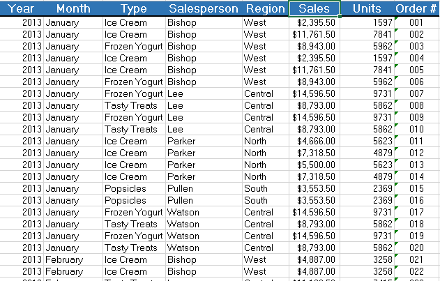
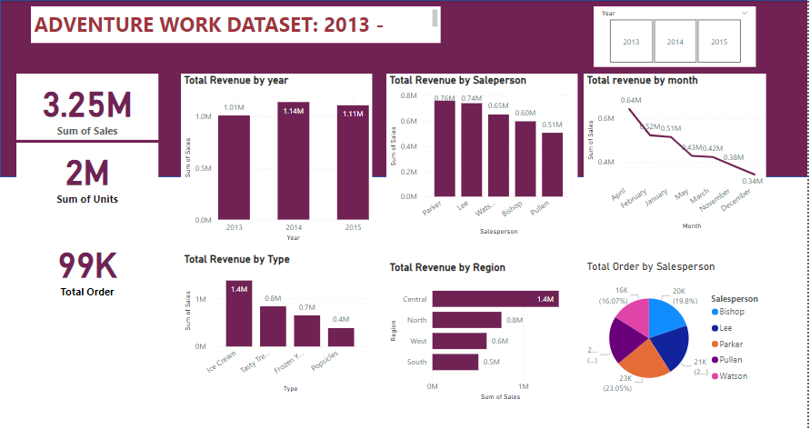

# ADVENTURE-WORK-SALES-ANALYSIS

## Introduction 
ADVENTURE WORK SALES ANALYSIS: 2013-2015
This dataset encapsulates a comprehensive overview of sales activities at Adventure Works, spanning from 2013 to 2015. The dataset captures various facets of sales transactions across different product categories, regions, and salespersons. The dataset is structured to aid in the analysis of sales patterns, identification of key performance indicators, and the formulation of data-driven strategies for enhancing business operations. Below is an overview of the key components of the dataset:
1. Time Period:
•	The dataset covers sales data for the months of January 2013 to December in the year 2015.
2. Product Categories:
•	The products sold include Ice Cream, Frozen Yogurt, Tasty Treats, and Popsicles.
3. Salespersons:
•	The sales were conducted by various salespersons including Bishop, Lee, Parker, Pullen, and Watson.
4. Regions:
•	The sales data spans across four major regions: West, Central, North, and South.
5. Key Metrics:
•	Sales: The monetary value of products sold.
•	Units: The quantity of products sold.
  Order #: The order number associated with each sale.
6. Data Structure:
•	Year: The year of the transaction.
•	Month: The month of the transaction.
•	Type: The category of the product sold.
•	Salesperson: The name of the salesperson who made the sale.
•	Region: The geographical region where the sale took place.
•	Sales: The revenue generated from the sale, represented in dollars.
•	Units: The number of units sold.
## Data Source
This is derived from the sales records of Adventure Works from 2013-2015, a company that deals with the sale of ice-cream, frozen yogurt, Popsicle and Tasty Treat, capturing various aspects of the company's sales activities across different regions, products, and sales personnel. The dataset was originally documented in Microsoft Excel and later cleaned, transformed, and visualized using Microsoft Power BI.
## Tools
The "Adventure Works Sales Analysis: 2013-2015" was meticulously processed using a combination of Microsoft Excel and Microsoft Power BI. Each tool played a distinct role in ensuring the data was clean, accurate, and presented in an insightful manner. Here is a summary of the tools and their specific applications:
1. Microsoft Excel
Purpose: Data Documentation
•	Data Entry and Initial Documentation:
o	The initial dataset was documented in Excel, capturing raw sales data across various parameters like year, month, product type, salesperson, region, sales amount, units sold, and order numbers.
2. Microsoft Power BI
Purpose: Data Cleaning, Transformation, and Visualization
•	Data Cleaning:
o	Identifying and removing duplicate entries to ensure data accuracy.
o	Standardizing data formats (e.g., date formats, numerical formats) for consistency.
o	Handling missing values appropriately, by imputing missing data or excluding incomplete records.
•	Data Visualization:
o	Importing the cleaned and transformed dataset into Power BI.
o	Designing a range of visualizations to represent the data, including bar charts, line graphs, and pie charts.
o	Developing interactive dashboards to enable dynamic data exploration and insight discovery (e.g., filtering by region, product type, or time period).
•	Data Analysis:
o	Utilizing Power BI’s advanced analytical features to perform in-depth data analysis.
o	Employing drill-down capabilities and cross-filtering to uncover deeper insights and trends.
o	Highlighting key performance indicators and patterns through comprehensive visual reports.

## Data Description
This dataset contains sales information for a company that sells various types of frozen treats, including Ice Cream, Frozen Yogurt, Tasty Treats, and Popsicles. The dataset includes the following columns:
1.	Year: The year in which the sales transaction occurred. The data covers multiple years.
2.	Month: The month in which the sales transaction occurred. This helps to identify seasonal trends and patterns.
3.	Type: The type of product sold. The product categories include "Ice Cream," "Frozen Yogurt," "Tasty Treats," and "Popsicles."
4.	Salesperson: The name of the salesperson who made the sale. Salespersons are responsible for selling products in different regions.
5.	Region: The geographical region where the sale took place. The regions include "West," "Central," "North," and "South."
6.	Sales: The revenue generated from the sale, represented in dollars. This is a monetary value showing how much money was made from each transaction.
7.	Units: The number of units sold in each transaction. This indicates the quantity of the product sold.
8.	Order #: The unique identifier for each sales order. This helps in tracking individual transactions.
## Problem Statement
1.	Sales Performance Analysis
Problem Statement: Which product type generates the highest sales revenue across different regions?
Objective: Identify the product types that are most popular in each region to optimize sales strategies and inventory management.
2.	Regional Sales Trends
Problem Statement: How do sales trends vary across different regions over time?
Objective: Analyze sales data by region to identify regions with high or low sales performance and investigate potential factors contributing to these trends.
3.	Salesperson Performance Evaluation
Problem Statement: Which salesperson has the highest sales performance, and how does this vary across different products and regions?
Objective: Assess the performance of salespersons to provide insights for performance incentives, training needs, and resource allocation.
4.	 Product Demand Forecasting
Problem Statement: Can we forecast future product demand based on historical sales data?
Objective: Use historical sales data to predict future demand for different products, aiding in inventory management and supply chain planning.
5.	 Duplicate Transaction Detection
Problem Statement: Are there duplicate transactions in the sales data, and how do they affect the accuracy of sales reporting?
Objective: Identify and address duplicate entries in the dataset to ensure accurate reporting and analysis of sales data.
6.	Seasonality Impact on Sales
Problem Statement: How does seasonality impact sales of different product types?
Objective: Analyze sales data by month to understand how different seasons or months impact sales, allowing for better marketing and inventory planning.
7.	Product Performance Across Time
Problem Statement: How do sales of different product types perform over time?
Objective: Evaluate the sales trends of each product type over the years to understand product life cycles and make informed decisions on product development and discontinuation.
8.	Customer Purchase Behavior Analysis
Problem Statement: What patterns exist in customer purchasing behavior for different product types?
Objective: Investigate the frequency and volume of purchases across different product types to understand customer preferences and optimize product offerings.

## Finding/Result
To derive specific findings or results from the dataset, a detailed analysis would need to be conducted. However, based on a preliminary inspection of the data, here are some possible findings or insights that could be uncovered:
1. Sales Distribution Across Product Types
Finding: The dataset shows that "Ice Cream" and "Frozen Yogurt" are the most frequently sold product types, with significant sales figures. In contrast, "Popsicles" appear less frequently, suggesting they may be less popular or have a smaller market share.
Implication: Focus marketing efforts and inventory on higher-performing products like Ice Cream and Frozen Yogurt while investigating why Popsicles have lower sales.
2. Regional Sales Performance
Finding: The Central region appears to have a higher concentration of sales, particularly for "Frozen Yogurt" and "Tasty Treats," compared to other regions.
Implication: The Central region could be a key market, and strategies should be tailored to sustain and grow this customer base. Other regions might need targeted promotions or new product introductions to boost sales.
3. Salesperson Performance
Finding: Salespersons like Bishop and Lee have repeated high sales figures, particularly in specific regions, suggesting they are top performers in their respective territories.
Implication: These salespersons could be recognized and rewarded for their performance, and their strategies could be shared with other team members to improve overall sales.
4. Potential Duplicate Transactions
Finding: The data contains several instances of transactions with identical sales figures, product types, and regions, indicating potential duplicates.
Implication: The presence of duplicate transactions may lead to overestimation of sales performance. Data cleaning is required to ensure accuracy in reporting and analysis.
5. Seasonal Sales Trends
Finding: All transactions in the dataset occur within January and December of 2013-2015, which might indicate seasonality effects, where sales could be driven by winter or New Year promotions.
Implication: A broader dataset across more months would be needed to fully understand seasonal impacts. However, current trends suggest certain products might perform better in winter.
6. Product and Salesperson Pairing
Finding: Specific salespersons seem to specialize in selling particular product types (e.g., Bishop with Ice Cream, Lee with Tasty Treats).
Implication: Understanding these pairings can help in optimizing sales strategies and assigning product lines to salespersons who perform best with them.
7. Revenue Concentration
Finding: A significant portion of the revenue is concentrated in large transactions, particularly for products like Frozen Yogurt.
Implication: These large orders are critical to revenue, and ensuring customer satisfaction for these orders should be a priority to maintain revenue streams.
## Recommendation
1. Focus on High-Performing Products
Recommendation: Allocate more resources (e.g., marketing, inventory, and promotions) to high-performing products like Ice Cream and Frozen Yogurt. These products are generating significant sales, especially in certain regions, and capitalizing on this can increase overall revenue.
2. Targeted Regional Marketing
Recommendation: Develop region-specific marketing strategies, particularly for the Central region, which shows strong sales figures. Additionally, tailor marketing efforts in underperforming regions like the South to boost sales of less popular products like Popsicles.
3. Incentivize and Train Sales Staff
Recommendation: Recognize and reward top-performing salespersons like Bishop and Lee, who have consistently high sales figures. Their successful strategies could be documented and used to train other sales team members to improve overall performance.
4. Address Duplicate Transactions
Recommendation: Conduct a thorough data cleaning process to identify and remove duplicate transactions. This will ensure accurate reporting and prevent skewed analysis, leading to more reliable business insights.
5. Expand Data Collection
Recommendation: Collect data across more months and years to understand the impact of seasonality on sales. This will help in forecasting demand and planning inventory more effectively throughout the year.
6. Diversify Product Portfolio
Recommendation: Given that some products like Popsicles are underperforming, consider either discontinuing low-demand products or investing in market research to understand and possibly boost demand through rebranding or product improvements.
7. Enhance Customer Engagement
Recommendation: Focus on customer engagement strategies, especially for large orders that contribute significantly to revenue. Offering personalized deals, follow-up services, or loyalty programs could help retain high-value customers.
8. Improve Inventory Management
Recommendation: Use the insights from sales data to optimize inventory management. For example, stocking more of the high-demand products and ensuring timely replenishment in regions with high sales can prevent stockouts and lost sales.
9. Implement Performance Analytics
Recommendation: Regularly track and analyze salesperson performance to identify trends and areas for improvement. Implementing performance analytics tools can help in making data-driven decisions and aligning sales strategies with company goals.
10. Consider Expanding into New Regions
Recommendation: If certain regions show consistently high sales, consider exploring new geographical markets with similar characteristics. This could lead to business expansion and growth in untapped areas.
By acting on these recommendations, the company can enhance its sales strategies, improve operational efficiency, and better meet customer needs, ultimately driving business growth.

